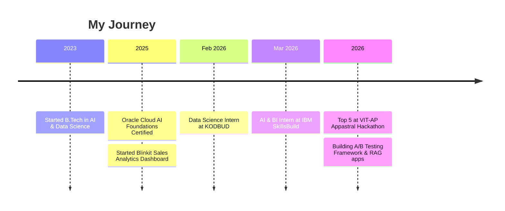

<!-- ================= HEADER BANNER ================= -->
<p align="center">
  
</p>

<p align="center">
  <a href="https://git.io/typing-svg">
    
  </a>
</p>

<p align="center">
  <a href="https://www.linkedin.com/in/koruprolu-venkata-amrutha-varshini-"></a>
  <a href="mailto:amruthakoruprolu56@gmail.com"></a>
  <a href="https://leetcode.com/YOUR_USERNAME"></a>
  <a href="https://www.codechef.com/users/YOUR_USERNAME"></a>
</p>

<p align="center">
  
  
  
  
</p>

---

## 👩‍💻 About Me

```python
class AmruthaVarshini:
    def __init__(self):
        self.role      = "B.Tech Student | AI & Data Science"
        self.college   = "Shri Vishnu Engineering College for Women"
        self.cgpa      = 8.90
        self.graduates = 2027
        self.focus     = ["Data Analytics", "Machine Learning", "Business Intelligence", "RAG / LLM Apps"]
        self.currently = ["Student Management System (Java)", "A/B Testing Framework (Python)"]
        self.certified = "Oracle Cloud Infrastructure 2025 AI Foundations Associate"

    def goal(self):
        return "Turn raw data into decisions that matter."
```

---

## 🏆 Highlights

<table align="center">
  <tr>
    <td align="center"><h2>🥇</h2><b>Top 5 Finalist</b><br/>VIT-AP Appastral Hackathon<br/><sub>among 100+ teams</sub></td>
    <td align="center"><h2>🏅</h2><b>Rank 4</b><br/>Inkola – Crafting Brain<br/><sub>among 250+ participants</sub></td>
    <td align="center"><h2>💰</h2><b>$1.2M+ Sales</b><br/>Visualized in Power BI<br/><sub>Blinkit Analytics Dashboard</sub></td>
    <td align="center"><h2>🗂️</h2><b>10,000+ Records</b><br/>Cleaned &amp; analysed<br/><sub>KODBUD Data Science Internship</sub></td>
  </tr>
</table>

---

## 🧰 Tech Stack

<h3>Languages</h3>
<p>
  
</p>

<h3>Data, ML &amp; BI</h3>
<p>
  
  <br/>
  
  
  
  
  
</p>

<h3>Cloud &amp; AI</h3>
<p>
  
  
  
  
  
  
</p>

<h3>Tools</h3>
<p>
  
</p>

<details>
<summary><b>📚 Core Computer Science &amp; Competencies</b></summary>
<br/>

- **Core CS:** Data Structures & Algorithms, DBMS, Operating Systems, Computer Networks, Machine Learning
- **Competencies:** Data Cleaning & Validation • Dashboard Development • Report Automation • Business Intelligence • Data Visualization • Trend Analysis

</details>

---

## 🚀 Featured Projects

<table>
  <tr>
    <td width="50%" valign="top">
      <h3>📊 Blinkit Sales Analytics Dashboard</h3>
      Interactive Power BI dashboard visualizing <b>$1.2M+</b> in retail sales through KPIs, sales trends and outlet analytics.
      <br/><br/>
      
      
      
      <br/><br/>
      <a href="https://github.com/koruproluammu/Blinkit-Sales-Analytics-Dashboard">🔗 View Repository</a>
    </td>
    <td width="50%" valign="top">
      <h3>🧪 A/B Testing Framework</h3>
      E-commerce optimization framework using <b>Frequentist and Bayesian</b> statistical analysis for data-backed decisions.
      <br/><br/>
      
      
      
      <br/><br/>
      <a href="https://github.com/koruproluammu/A-B-Testing-Framework-with-Statistical-Rigor">🔗 View Repository</a>
    </td>
  </tr>
  <tr>
    <td width="50%" valign="top">
      <h3>🤟 Sign Language Recognition System</h3>
      End-to-end <b>AutoML</b> solution built on IBM Watsonx.ai to train, evaluate and deploy models on IBM Cloud via REST API.
      <br/><br/>
      
      
      
      <br/><br/>
      <a href="https://github.com/koruproluammu/Sign-language-detection">🔗 View Repository</a>
    </td>
    <td width="50%" valign="top">
      <h3>🤖 AI Chatbot with RAG</h3>
      Retrieval-Augmented chatbot using vector embeddings and an LLM API to deliver grounded, domain-specific answers.
      <br/><br/>
      
      
      
      <br/><br/>
      <a href="https://github.com/koruproluammu/AI-Chatbot-with-RAG">🔗 View Repository</a>
    </td>
  </tr>
  <tr>
    <td width="50%" valign="top">
      <h3>💹 FinAgent – RAG Financial Analysis</h3>
      AI financial analyst combining market data, financial news and sentiment analysis with LLM-powered insights.
      <br/><br/>
      
      
      <br/><br/>
      <a href="https://github.com/koruproluammu/FinAgent-RAG-Financial-Analysis">🔗 View Repository</a>
    </td>
    <td width="50%" valign="top">
      <h3>🎓 Student Management System</h3>
      Console-based Java application with full <b>CRUD</b> operations, file handling and exception handling for managing student records.
      <br/><br/>
      
      
      
      <br/><br/>
      <a href="https://github.com/koruproluammu">🔗 View Repository</a>
    </td>
  </tr>
</table>

---

## 💼 Experience Timeline



| Role | Organization | Duration | Impact |
|---|---|---|---|
| **AI & Business Intelligence Intern** | IBM SkillsBuild | Mar – Apr 2026 | Hands-on exposure to AI, BI and data-driven decision-making |
| **Data Science Intern** | KODBUD | Feb – Mar 2026 | EDA and data cleaning on COVID-19 & IPL datasets (10,000+ records) |

---

## 📜 Certifications

<p>
  <br/>
  
  <br/>
  
  
</p>

---

## 📈 GitHub Analytics

<p align="center">
  
  
</p>

<p align="center">
  
</p>

<p align="center">
  
</p>

---

## 🤝 Let's Connect

I'm open to **internships and collaborations** in Data Analytics, Machine Learning and AI. If you have an idea, a dataset or a problem worth solving, reach out.

<p align="center">
  <a href="https://www.linkedin.com/in/koruprolu-venkata-amrutha-varshini-"></a>
  <a href="mailto:amruthakoruprolu56@gmail.com"></a>
</p>

<p align="center">
  <i>"Data is the new oil, but insight is the engine."</i>
</p>

<p align="center">
  
</p>
